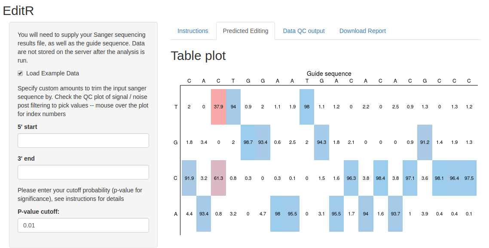

# EditR

EditR is an algorithm for predicting potential editing in a guide RNA region from a single Sanger sequencing run. This allows users to estimate base editing efficiency quicker and cheaper than using deep sequencing.

It consists of the algorithm implemented in the R statistical programming language and provided as a Shiny app built to make this algorithm easy to use.

## Try out EditR

[**Click this link to try EditR live**](https://moriaritylab.shinyapps.io/editr-master/)

## Citation

If this software helps you -- please cite us!

Kluesner M, Nedveck D, Lahr W, Moriarity B. Simple and cost effective quantitative assessment of base editing by quantification of Sanger trace fluorescence. *Nucleic Acid Research.* 2017. *In review*

## Using the Shiny App

You can use the R Shiny App in two ways: through and instance on shinyapps.io, or installing it locally on your computer. We recommend testing it out on shinyapps.io, and then installing it locally to do a lot of analysis with.

### Testing it out on shinyapps.io

We have [an instance on shinyapps.io here](https://moriaritylab.shinyapps.io/editr-master/). If it’s not working, it’s likely that we used up our usage for the month, and you will have to install EditR locally.

### Installing EditR locally

1. [Install R](https://cran.r-project.org/) and [R Studio (desktop version)](https://www.rstudio.com/products/rstudio/download/#download)
2. Download code from github repository, and unzip into a directory you want to work from
3. Open R Studio and run the code in dependencies.R to install the packages required
4. In R Studio, open server.R, and click the run app button
5. EditR should be started in your default web browser

## Issues / problems

If there are issues with R, R Studio, installing R packages, or Shiny, please search for the error in your search engine of choice.

If you run into a problem with EditR, please feel free to [submit and issue on GitHub](https://github.com/MoriarityLab/EditR/issues), or contact us at baseeditr@gmail.com
